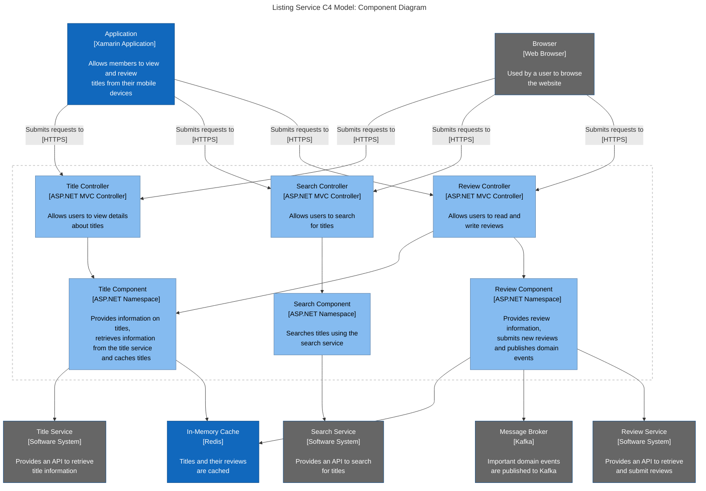

```mermaid
---
title: "Listing Service C4 Model: Component Diagram"
---
flowchart TD
    classDef container fill:#1168bd,stroke:#0b4884,color:#ffffff
    classDef externalSystem fill:#666,stroke:#0b4884,color:#ffffff
    classDef component fill:#85bbf0,stroke:#5d82a8,color:#000000

    Browser["Browser
    [Web Browser]

    Used by a user to browse
    the website"]

    MA["Application
    [Xamarin Application]

    Allows members to view and review
    titles from their mobile devices"]

    R["In-Memory Cache
    [Redis]

    Titles and their reviews
    are cached"]

    K["Message Broker
    [Kafka]

    Important domain events
    are published to Kafka"]

    TS["Title Service
    [Software System]

    Provides an API to retrieve
    title information"]

    RS["Review Service
    [Software System]

    Provides an API to retrieve
    and submit reviews"]

    SS["Search Service
    [Software System]

    Provides an API to search
    for titles"]

    TCont["Title Controller
    [ASP.NET MVC Controller]

    Allows users to view details
    about titles"]

    SCont["Search Controller
    [ASP.NET MVC Controller]

    Allows users to search
    for titles"]

    RCont["Review Controller
    [ASP.NET MVC Controller]

    Allows users to read and
    write reviews"]

    TComp["Title Component
    [ASP.NET Namespace]

    Provides information on titles,
    retrieves information from the title service
    and caches titles"]

    SComp["Search Component
    [ASP.NET Namespace]

    Searches titles using the
    search service"]

    RComp["Review Component
    [ASP.NET Namespace]

    Provides review information,
    submits new reviews
    and publishes domain events"]

    Browser-- "Submits requests to\n[HTTPS]" --->TCont
    MA-- "Submits requests to\n[HTTPS]" --->TCont

    MA-- "Submits requests to\n[HTTPS]" --->SCont
    Browser-- "Submits requests to\n[HTTPS]" --->SCont

    MA-- "Submits requests to\n[HTTPS]" --->RCont
    Browser-- "Submits requests to\n[HTTPS]" --->RCont

    subgraph listing-service[Listing Service]
        TCont--->TComp
        RCont--->TComp
        RCont--->RComp

        SCont--->SComp
    end

    TComp--->TS
    TComp--->R
    RComp--->R
    RComp--->K
    RComp--->RS

    SComp--->SS

class MA,R container
class SS,RS,TS,K,Browser externalSystem
class RComp,SComp,TComp,RCont,SCont,TCont component
style listing-service fill:none,stroke:#CCC,stroke-width:2px
style listing-service color:#fff,stroke-dasharray: 5 5
```
