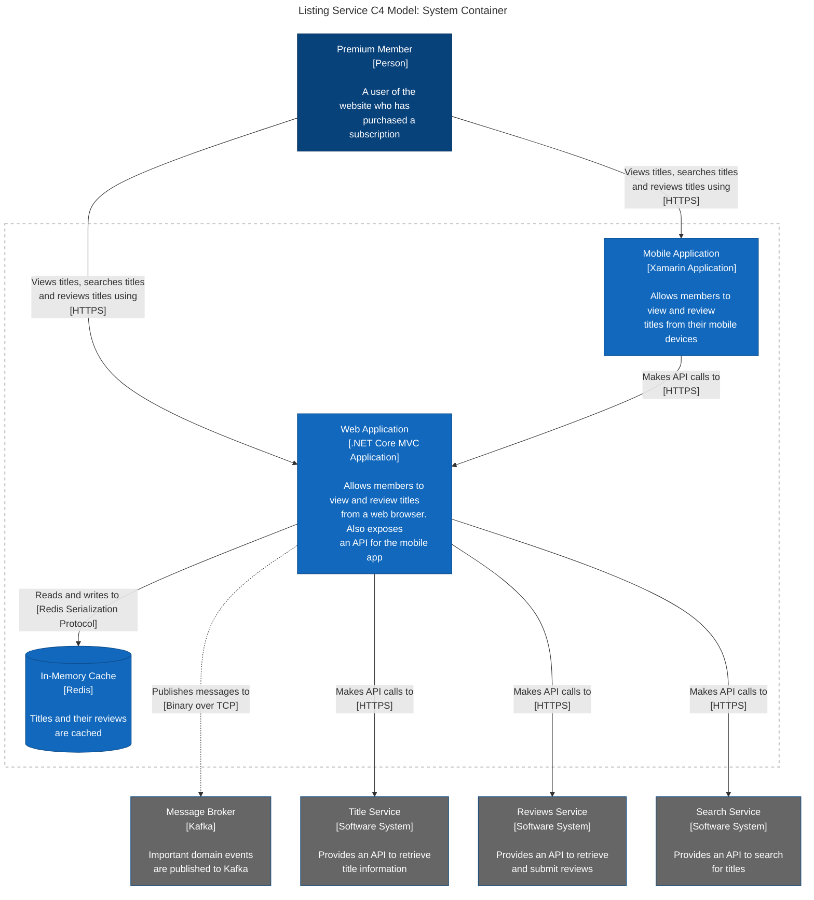

```mermaid
---
title: "Listing Service C4 Model: System Container"
---
flowchart TD
    User["Premium Member
 	    [Person]
 	    
 	    A user of the website who has
 	    purchased a subscription"]

    WA["Web Application
        [.NET Core MVC Application]
        
        Allows members to view and review titles
        from a web browser. Also exposes
        an API for the mobile app"]

    MA["Mobile Application
        [Xamarin Application]
        
        Allows members to view and review
        titles from their mobile devices"]

    R[("In-Memory Cache
        [Redis]
        
        Titles and their reviews
 	    are cached")]
    K["Message Broker
        [Kafka]

        Important domain events
        are published to Kafka"]

    TS["Title Service
        [Software System]

        Provides an API to retrieve
        title information"]

    RS["Reviews Service
        [Software System]

        Provides an API to retrieve
        and submit reviews"]

    SS["Search Service
        [Software System]

        Provides an API to search
        for titles"]

    User-- "Views titles, searches titles
    and reviews titles using
    [HTTPS]" -->WA

    User-- "Views titles, searches titles
    and reviews titles using
    [HTTPS]" -->MA
    
    subgraph  listing-service[Listing Service]
        MA -- "Makes API calls to \n[HTTPS]" --> WA
        
        WA -- "Reads and writes to \n[Redis Serialization Protocol]" --> R
    end
    
    WA-. "Publishes messages to\n[Binary over TCP]" ..->K
    WA-- "Makes API calls to\n[HTTPS]" --->TS
    WA-- "Makes API calls to\n[HTTPS]" --->RS
    WA-- "Makes API calls to\n[HTTPS]" --->SS
    
 	classDef container fill:#1168bd,stroke:#0b4884,color:#ffffff
 	classDef person fill:#08427b,stroke:#052e56,color:#ffffff
    classDef supportingSystem fill:#666,stroke:#0b4884,color:#ffffff

    class User person
    class WA,MA,R container
    class TS,RS,SS,K supportingSystem

style listing-service fill:none,stroke:#CCC,stroke-width:2px
    style listing-service color:#fff,stroke-dasharray: 5 5
 	
```