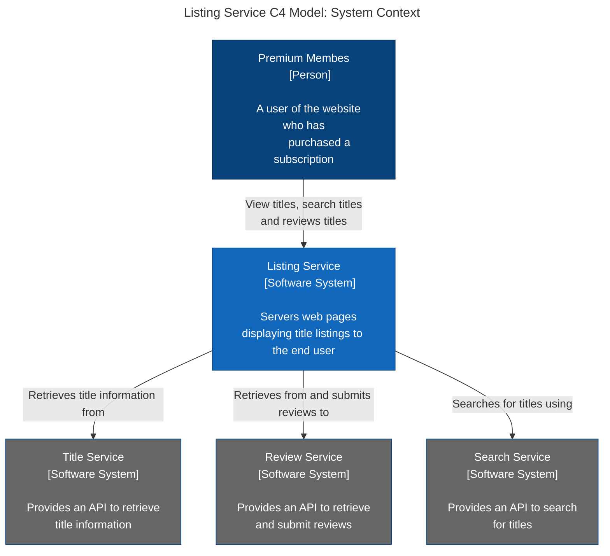

```mermaid
---
title: "Listing Service C4 Model: System Context"
---
flowchart TD
    User["Premium Membes
    [Person]
    
    A user of the website who has
	   purchased a subscription"]
	   
    LS["Listing Service
    [Software System]
    
    Servers web pages displaying title listings to the end user"]
    
    TS["Title Service
    [Software System]
    
    Provides an API to retrieve
    title information"]

    RS["Review Service
    [Software System]

    Provides an API to retrieve
    and submit reviews"]
    
    SS["Search Service
    [Software System]

    Provides an API to search
    for titles"]
    
    User -- "View titles, search titles\nand reviews titles" --> LS
    
    LS -- "Retrieves title information from" --> TS
    LS -- "Retrieves from and submits reviews to" --> RS
    LS -- "Searches for titles using" --> SS
    
   classDef focusSystem fill:#1168bd,stroke:#0b4884,color:#ffffff
   classDef supportingSystem fill:#666,stroke:#0b4884,color:#ffffff
   classDef person fill:#08427b,stroke:#052e56,color:#ffffff
   
   class User person
   class LS focusSystem
   class TS,RS,SS supportingSystem
```