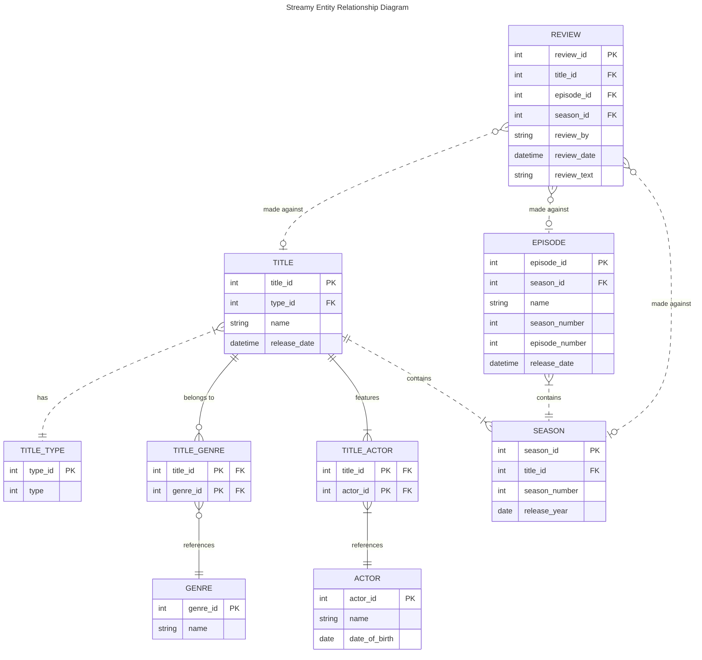

```mermaid
---
    title: Streamy Entity Relationship Diagram
---
erDiagram
    TITLE {
        int title_id PK
        int type_id FK
        string name
        datetime release_date
    }
    
    ACTOR {
        int actor_id PK
        string name
        date date_of_birth
    }

    TITLE_ACTOR {
        int title_id PK "FK"
        int actor_id PK "FK"
    }

    SEASON {
        int season_id PK
        int title_id FK
        int season_number
        date release_year
    }
    
    EPISODE {
        int episode_id PK
        int season_id FK
        string name
        int season_number
        int episode_number
        datetime release_date
    }

    REVIEW {
        int review_id PK
        int title_id FK
        int episode_id FK
        int season_id FK
        string review_by
        datetime review_date
        string  review_text
    }

    GENRE {
        int genre_id PK
        string name
    }

    TITLE_TYPE {
        int type_id PK
        int type
    }
    
    TITLE_GENRE {
        int title_id PK "FK"
        int genre_id PK "FK"
    }
    
    
    TITLE }|..|| TITLE_TYPE: has
    TITLE ||--o{ TITLE_GENRE: "belongs to"
    TITLE ||--|{ TITLE_ACTOR: features
    TITLE ||..|{ SEASON: contains
    
    TITLE_GENRE }o--|| GENRE: references
    TITLE_ACTOR }|--|| ACTOR: references
    
    EPISODE }|..|| SEASON: contains
    
    REVIEW }o..o| TITLE: "made against"
    REVIEW }o..o| EPISODE: "made against"
    REVIEW }o..o| SEASON: "made against"
```