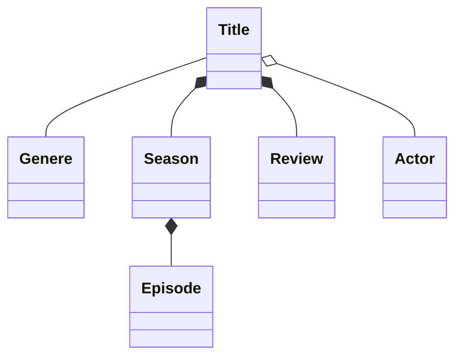

### Examples

- Associations, which are two entities that are loosely related and can exist independent of one another. For example: `Title` and `Genere`

- Compositions, which indicate two entities are tightly related and cannot exist independently of one another. For example: `Title` and `Season`

- In an aggregate relationship, there’s still an owner—the parent. However, the bond between them isn’t as strong as a composite relationship, and if the parent were to be deleted, the child can still exist. For example: `Title` and `Actor`

### For more details

- Association: there’s a relationship between the entities, with at least one entity holding a reference to the other. There’s no owner of the relationship though, and they can exist completely independently of one another. An example separate from Streamy might be a Teacher and Student relationship.

- Aggregations: there’s a more direct relationship between the entities than an association, but they can still exist independently of one another. There’s an owner of the relationship, but if the parent is deleted, the child can still remain. Continuing the education theme, a Teacher has an aggregate relationship to Class. You could delete the Teacher, but the Class would still remain and make sense on its own.

- Compositions: the closest of relationships is reserved for compositions. Similarly to aggregations, there’s an owner of the relationship. However, if the parent is deleted, the child must be deleted, too, and makes no sense without its parent relationship. Picking up the education theme once more, Grade could be a composite relation to Class—if the Class were deleted, the Grade probably wouldn’t make sense unless it’s linked to a Class.
