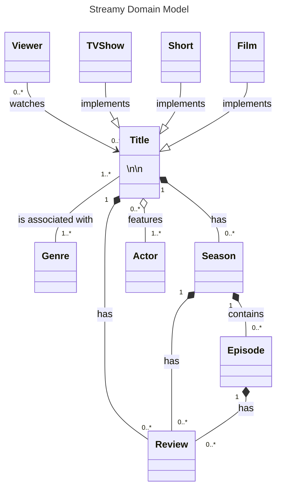

```mermaid
---
title: Streamy Domain Model
---
classDiagram
    Title "1..*" -- "1..*" Genre: is associated with
    %% Added to improve readability
    Title: \n\n
    link Title "http://www.example.com" _blank

    Title "1" *-- "0..*" Season :has
    Title "1" *-- "0..*" Review :has
    Title "0..*" o--  "1..*" Actor :features

    Viewer "0..*" --> "0..*" Title :watches

    TV Show --|> Title :implements
    Short --|> Title :implements
    Film --|> Title :implements

    Season "1" *-- "0..*" Review :has
    Season "1" *-- "0..*" Episode :contains
    Episode "1" *-- "0..*" Review :has
```
