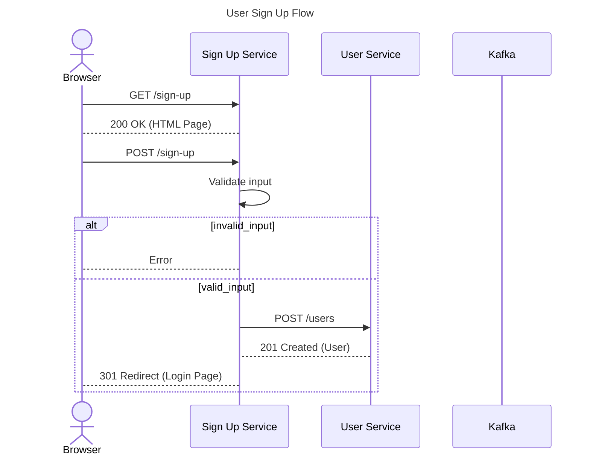

```mermaid
---
title: User Sign Up Flow
---
sequenceDiagram
    actor Browser
    participant  Sign Up Service
    participant  User Service
    participant  Kafka
    
    Browser ->> Sign Up Service: GET /sign-up
    Sign Up Service --> Browser:  200 OK (HTML Page)
    
    Browser ->> Sign Up Service : POST /sign-up
    Sign Up Service ->> Sign Up Service: Validate input
    
    alt invalid_input
        Sign Up Service --> Browser: Error
    else valid_input
        Sign Up Service ->> User Service: POST /users
        User Service --> Sign Up Service: 201 Created (User)
        Sign Up Service --> Browser: 301 Redirect (Login Page)
    end
```