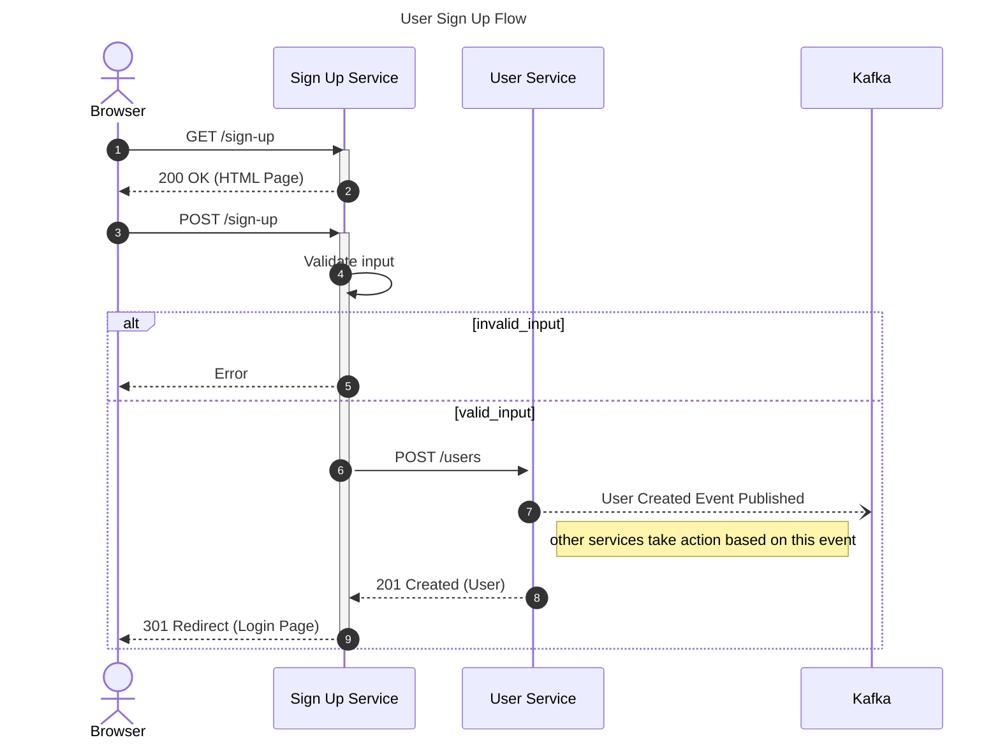

```mermaid
---
title: User Sign Up Flow
---
sequenceDiagram
    autonumber
    
    actor Browser
    participant  Sign Up Service
    participant  User Service
    participant  Kafka
    
    Browser ->> Sign Up Service: GET /sign-up
    activate Sign Up Service
    Sign Up Service -->> Browser:  200 OK (HTML Page)
    deactivate Sign Up Service
    
    Browser ->>+ Sign Up Service : POST /sign-up
    Sign Up Service ->> Sign Up Service: Validate input
    
    alt invalid_input
        Sign Up Service -->> Browser: Error
    else valid_input
        Sign Up Service ->>+ User Service: POST /users
        User Service --) Kafka: User Created Event Published
        Note left of Kafka: other services take action based on this event
%%        Note over User Service, Kafka: other services take action based on this event
        User Service -->> Sign Up Service: 201 Created (User)
        Sign Up Service -->>- Browser: 301 Redirect (Login Page)
    end
```