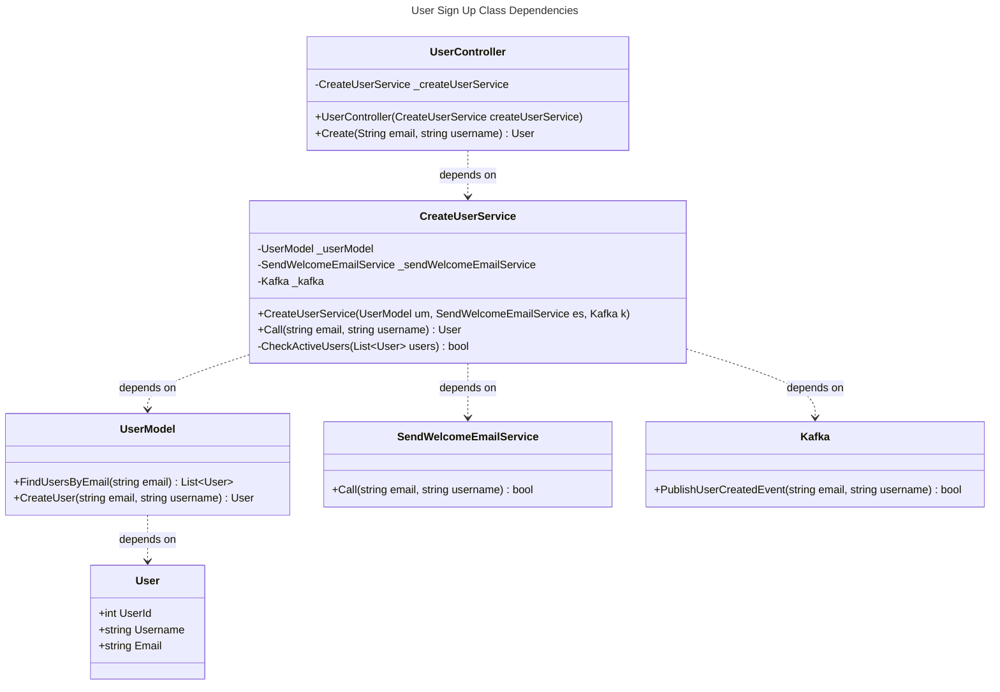

```mermaid
---
    title: User Sign Up Class Dependencies
---
classDiagram
    class UserController {
        -CreateUserService _createUserService
        +UserController(CreateUserService createUserService)
        +Create(String email, string username) User
    }
    
    class CreateUserService {
        -UserModel _userModel
        -SendWelcomeEmailService _sendWelcomeEmailService
        -Kafka _kafka
        +CreateUserService(UserModel um, SendWelcomeEmailService es, Kafka k)
        +Call(string email, string username) User
        -CheckActiveUsers(List~User~ users) bool
    }
    
    class UserModel {
        +FindUsersByEmail(string email) List~User~
        +CreateUser(string email, string username) User
    }
    
    class User {
        +int UserId
        +string Username
        +string Email
    }
    
    class SendWelcomeEmailService {
        +Call(string email, string username) bool
    }
    
    class Kafka {
        +PublishUserCreatedEvent(string email, string username) bool
    }
    
    UserController ..> CreateUserService: depends on
    CreateUserService ..> UserModel: depends on
    UserModel ..> User: depends on
 	CreateUserService ..> SendWelcomeEmailService: depends on
 	CreateUserService ..> Kafka: depends on

```