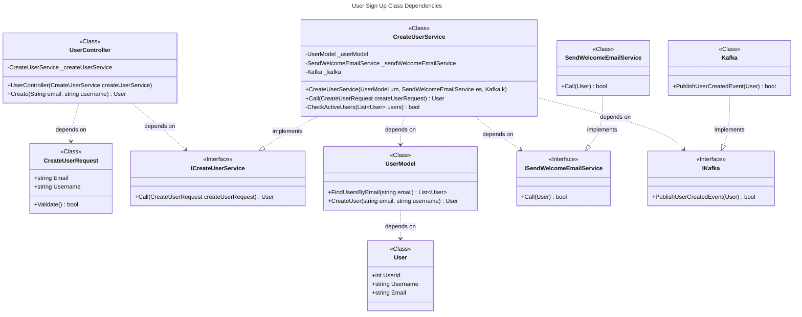

```mermaid
---
    title: User Sign Up Class Dependencies
---
classDiagram
    class UserController {
        <<Class>>
        -CreateUserService _createUserService
        +UserController(CreateUserService createUserService)
        +Create(String email, string username) User
    }
    
    class CreateUserRequest {
        <<Class>>
 	    +string Email
 	    +string Username

 	    +Validate() bool
 	}
 	
    class ICreateUserService {
 	    <<Interface>>
 	    +Call(CreateUserRequest createUserRequest) User
 	}

    class CreateUserService {
        <<Class>>
        -UserModel _userModel
        -SendWelcomeEmailService _sendWelcomeEmailService
        -Kafka _kafka
        +CreateUserService(UserModel um, SendWelcomeEmailService es, Kafka k)
        +Call(CreateUserRequest createUserRequest) User
        -CheckActiveUsers(List~User~ users) bool
    }
    
    class UserModel {
        <<Class>>
        +FindUsersByEmail(string email) List~User~
        +CreateUser(string email, string username) User
    }
    
    class User {
        <<Class>>
        +int UserId
        +string Username
        +string Email
    }
    
    class SendWelcomeEmailService {
        <<Class>>
        +Call(User) bool
    }

    class ISendWelcomeEmailService {
        <<Interface>>
        +Call(User) bool
    }
    
    class Kafka {
        <<Class>>
        +PublishUserCreatedEvent(User) bool
    }
    
    class IKafka {
        <<Interface>>
        +PublishUserCreatedEvent(User) bool
    }

    UserController ..> ICreateUserService: depends on
    UserController ..> CreateUserRequest: depends on
    
    CreateUserService ..> UserModel: depends on
    UserModel ..> User: depends on
    
    CreateUserService ..> ISendWelcomeEmailService: depends on
    CreateUserService ..> IKafka: depends on
    
    CreateUserService ..|> ICreateUserService: implements
    SendWelcomeEmailService ..|> ISendWelcomeEmailService: implements
    Kafka ..|> IKafka: implements
```