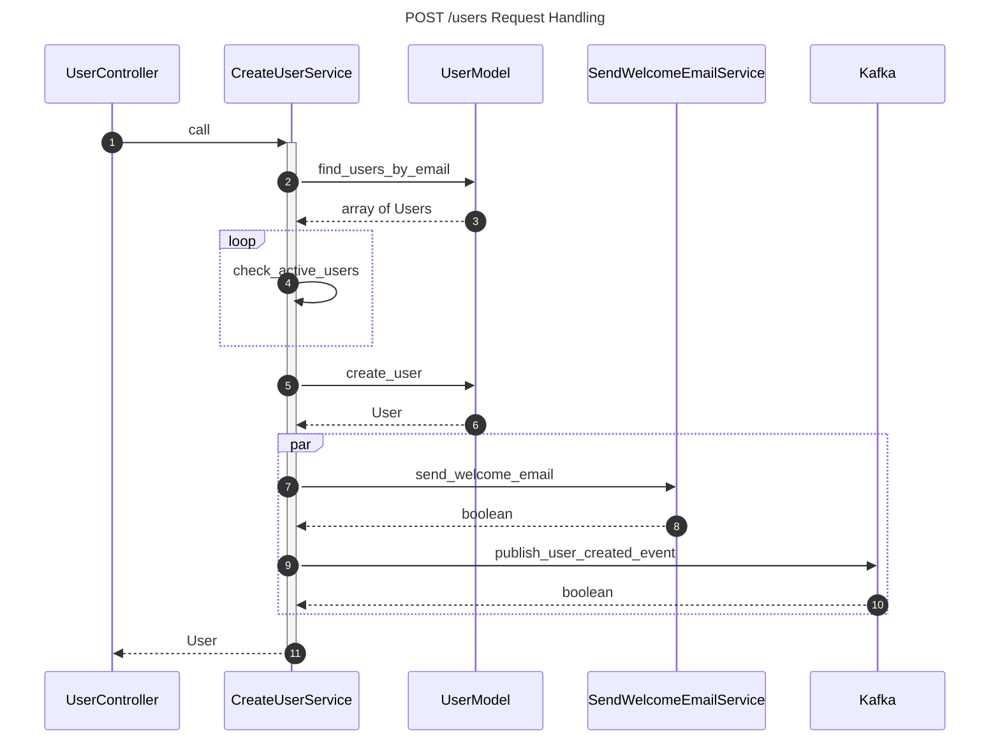

```mermaid
---
title: POST /users Request Handling
---
sequenceDiagram
    autonumber
    
    participant UserController
    participant CreateUserService
    participant UserModel
    participant SendWelcomeEmailService
    participant Kafka

    UserController->>+CreateUserService: call
    CreateUserService->>UserModel: find_users_by_email
    UserModel-->>CreateUserService: array of Users
    
    loop
        CreateUserService->>CreateUserService: check_active_users
    end
    
    CreateUserService->>UserModel: create_user
    UserModel-->>CreateUserService: User
    
    par
        CreateUserService->>SendWelcomeEmailService: send_welcome_email
        SendWelcomeEmailService-->>CreateUserService: boolean

        CreateUserService->>Kafka: publish_user_created_event
        Kafka-->>CreateUserService: boolean
    end

    CreateUserService-->>-UserController: User
```