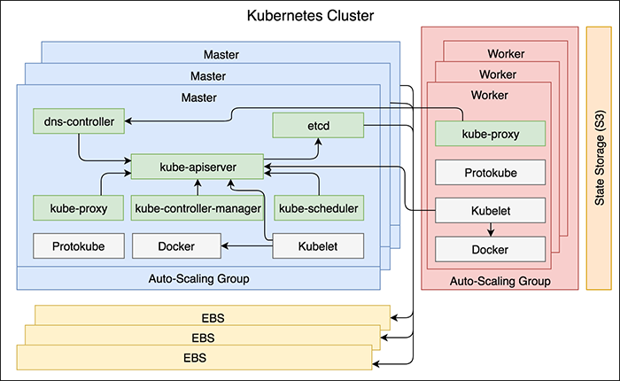

## Diagram
### Core Components

### Update

> The kops update command applies all the changes to the cluster at once. That can result in downtime.

> The kops rolling-update command intends to apply the changes without downtime. 
It would apply them to one server at the time so that most of the servers are always running. In parallel, Kubernetes would be rescheduling the Pods that were running on the servers that were brought down.

### Update Process
 
1. Kops retrieved the desired state from the S3 bucket.
2. Kops sent requests to AWS API to change the values of the workers ASG.
3. AWS modified the values of the workers ASG by increasing them by 1.
4. ASG created a new EC2 instance to comply with the new sizing.
5. Protokube installed Kubelet and Docker and created the manifest file with the list of Pods.
6. Kubelet read the manifest file and run the container that forms the kube-proxy Pod (the only Pod on the worker nodes).
7. Kubelet sent a request to the kube-apiserver (through the dns-controller) to register the new node and join it to the cluster. The information about the new node is stored in etcd.s.png)
