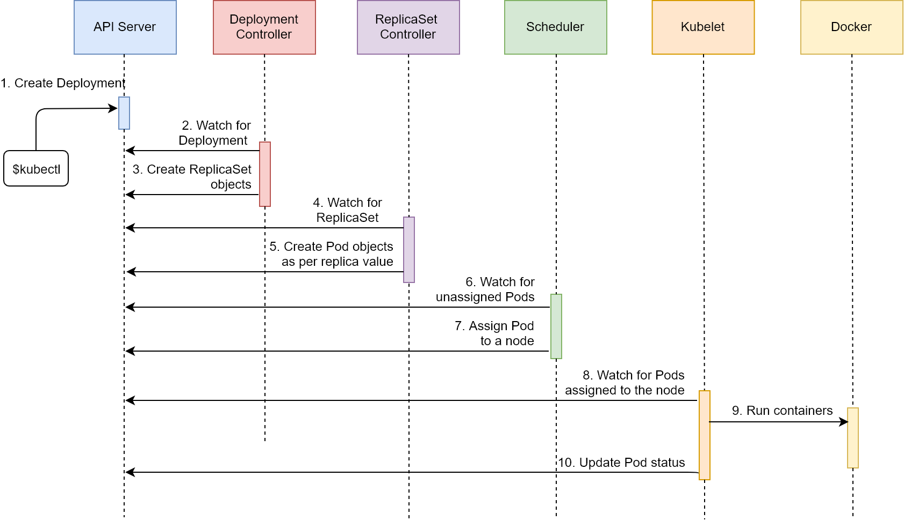

## Diagram


## Create Deployment
```bash
kubectl apply -f db-demo.yml 
```

## Update Image Deployment
```bash
kubectl set image \
  -f db-demo.yml  \
  db=mongo:5 \
  -- record
```

## Create Zero Deployment
```bash
kubectl apply -f zero-down-time-api.yml 
```

## Demo Zero Deployment
#### Delete All And Run Full Flow
```bash
kubectl delete -f db-demo.yml
kubectl delete -f db-service.yml
kubectl delete -f zero-down-time-api.ym

kubectl apply -f full.yml 
```
#### Set image

```bash
kubectl set image -f zero-down-time.yml api=vfarcic/go-demo-2:2.0 --record
```

#### Check rollout status

```bash
kubectl rollout status -w -f zero-down-time.yml
```

#### Check events

```bash
kubectl describe -f zero-down-time.yml
```

#### View rollout history

```bash
kubectl rollout history -f zero-down-time.yml
```

## Updating the deployment by label

```bash
kubectl set image deployments \
  -l type=db,vendor=MongoLabs \
  db=mongo:3.4 --record
```

## Rollback

```bash
kubectl rollout undo -f zero-down-time.yml
```

## Rollback to specific revision

```bash
kubectl rollout undo -f zero-down-time.yml --to-revision=2
kubectl rollout history -f zero-down-time.yml
```

## Scale Deployment

```bash
kubectl scale deployment go-demo-2-api --replicas 8 --record
```
