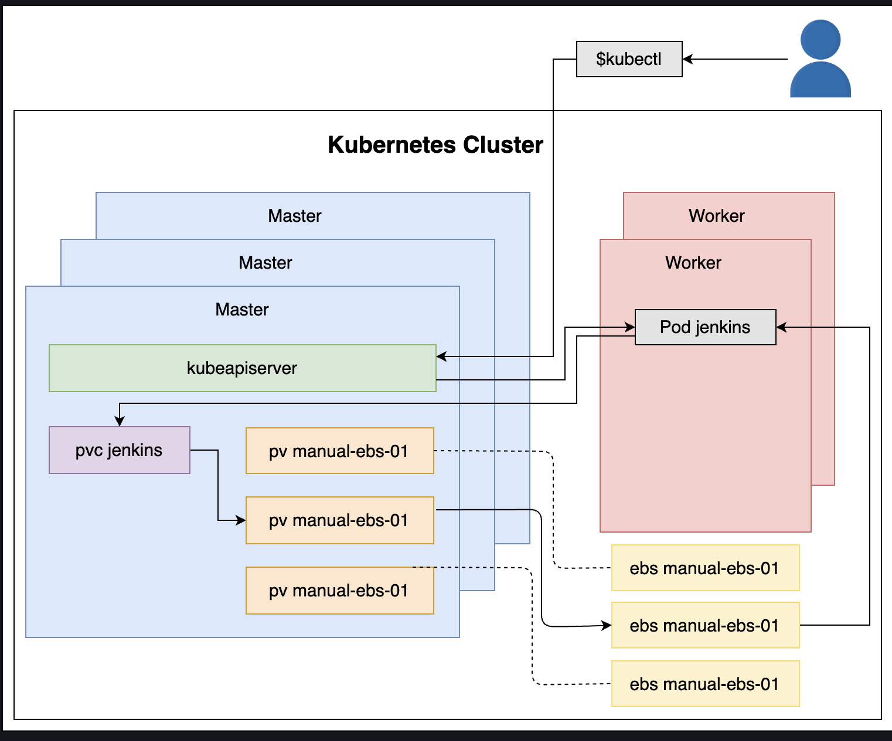

## Flow Create Persisting State With AWS EBS

1. We executed kubectl command.
2. kubectl sent a request to kube-apiserver to create the resources defined in pv/jenkins-pv.yml.
3. Among others, the jenkins Pod was created in one of the worker nodes.
4. Since jenkins container in the Pod has a PersistentVolumeClaim, it mounted it as a logical volume.
5. The PersistentVolumeClaim was already bound to one of the PersistentVolumes.
6. The PersistentVolume is associated with one of the EBS volumes.
7. The EBS volume was mounted as a physical volume to the jenkins Pod.
