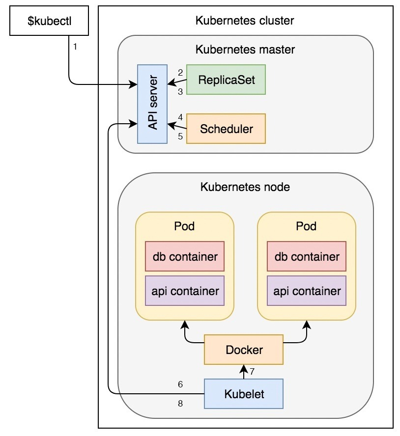

## Diagram



## Create Replicaset
```bash
kubectl create -f demo.yml
```

## Get Replicaset
```bash
kubectl get rs
kubectl get -f demo.yml
```

## Describe Replicaset
```bash
kubectl describe -f demo.yml
```

## Get pods with labels
```bash
kubectl get pods --show-labels
```

## Delete Replicaset without delete pod
```bash
kubectl delete -f demo.yml --cascade=orphan
```

## Update Replica set
> The apply command automatically saves the configuration so that we can edit it later on. The create command does not do such thing by default so we had to save it with --save-config.
```bash
kubectl apply -f demo.yml
```

## Destroy Pod For Testing Self Healing
```bash
POD_NAME=$(kubectl get pods -o name | tail -1)

kubectl delete $POD_NAME
```
