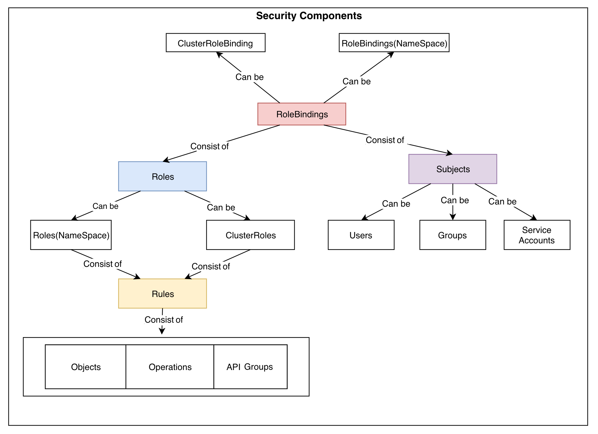

## Diagram


## Create Demo Application
```bash
kubectl create \
    -f go-demo-2.yml \
    --record --save-config
```

## Create A User
### Generate Public Key
```bash
mkdir -p keys
openssl genrsa -out keys/louis.key 2048
```

### Generate a Private Key
```bash
openssl req -new \
  -key keys/louis.key \
  -out keys/louis.csr \
  -subj "/CN=louis/O=devs"
```

### Create final certificate for k3d
```bash
ls -1 /usercode/certs/client-ca.*

openssl x509 -req \
    -in keys/louis.csr \
    -CA /usercode/certs/client-ca.crt \
    -CAkey /usercode/certs/client-ca.key \
    -CAcreateserial \
    -out keys/louis.crt \
    -days 365

cp keys/* /usercode/certs/keys
cp /usercode/certs/server-ca.crt /usercode/certs/keys
```

### Accessing the Cluster as a User
```bash
kubectl config set-cluster louis \
    --certificate-authority \
    /usercode/certs/keys/server-ca.crt \
    --server $SERVER

kubectl config set-credentials louis \
    --client-certificate keys/louis.crt \
    --client-key keys/louis.key

kubectl config set-context louis \
    --cluster louis \
    --user louis

kubectl config use-context louis
```

### Verify Permission
```bash
kubectl auth can-i get pods --as louis

kubectl get roles #Get Default Namespace Roles
kubectl get clusterroles #Get Whole Cluster Roles

kubectl describe clusterrole view
kubectl describe clusterrole edit
kubectl describe clusterrole admin
```

### Create Role Binding
```bash
kubectl create rolebinding louis \
  --clusterrole view \
  --user louis \
  --namespace default \
  --save-config

kubectl get rolebindings
kubectl describe rolebinding jdoe

# Delete after using
kubectl delete rolebinding jdoe
```

### Create Cluster Role Binding
```bash
kubectl create -f crb-view.yml --record --save-config

kubectl describe clusterrolebinding view
```
