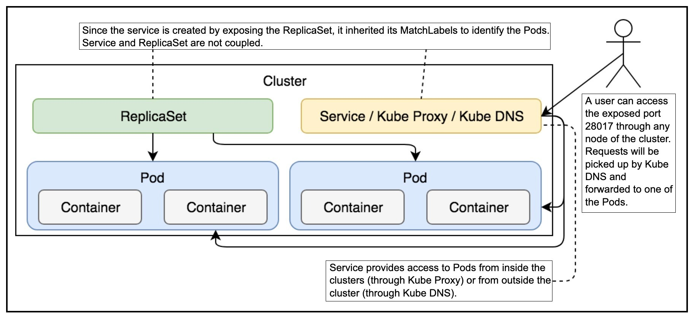
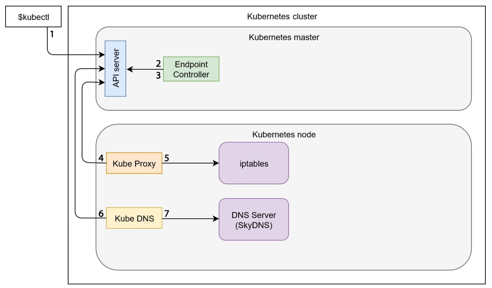

## Diagram




## Exposing a replica set resource
```bash
kubectl expose rs go-demo-2 \
  --name=go-demo-2-svc \
  --target-port=28017 \
  --type=NodePort
```

## Port forward the service
```bash
kubectl port-forward service/go-demo-2-svc 5005:28017 --address 0.0.0.0
```

## Delete service
```bash
kubectl delete svc go-demo-2-svc
```

## Create Service Declarative way

```bash
kubectl apply -f svc.yml 
```

## Get Service Info

```bash
kubectl get -f svc.yml 
```

## Test full flow

```bash
chmod +x test.sh && ./test.sh
```

## Destroy all

```bash
chmod +x destroy.sh && ./destroy.sh
```
